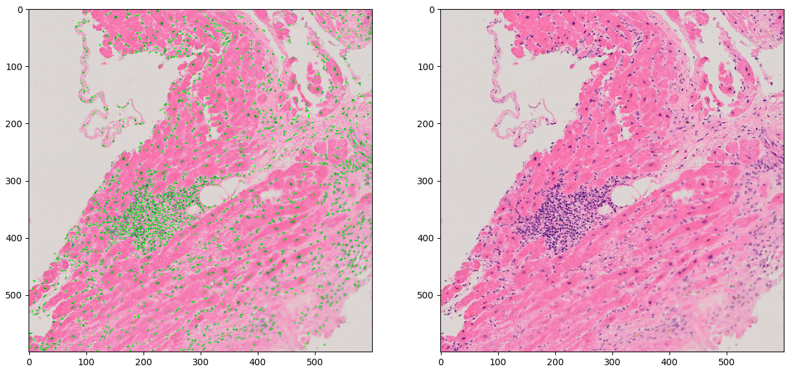
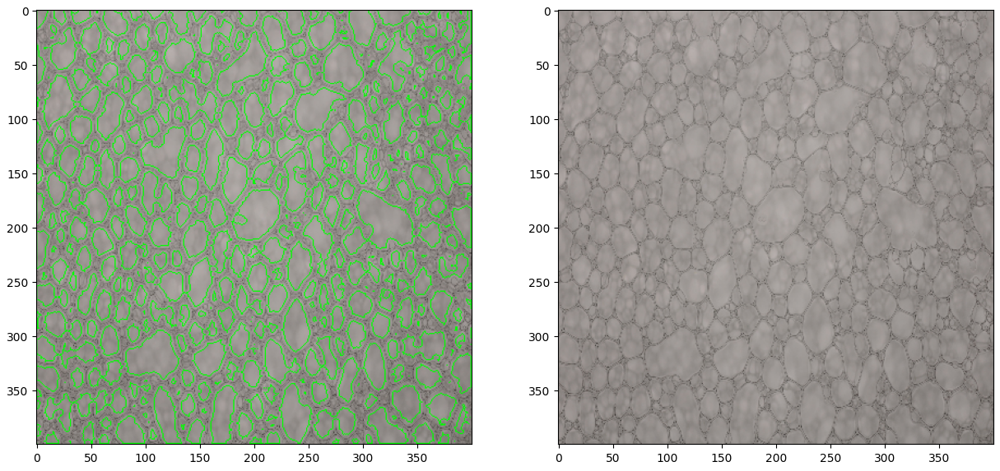
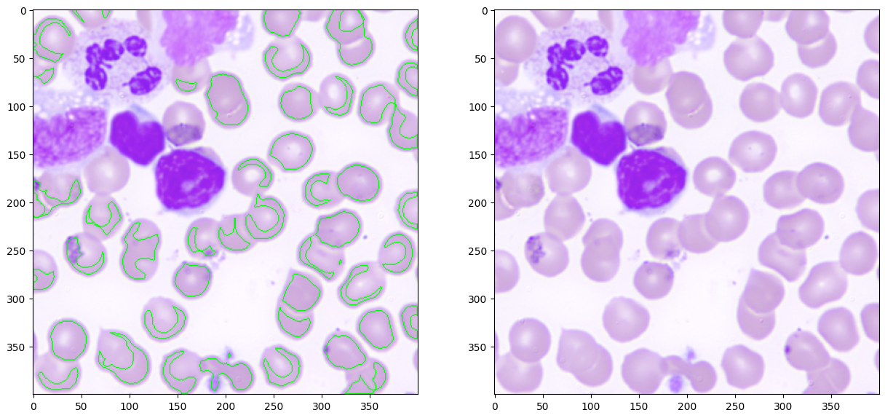

# Assignment 1

Viktor Modroczký (vktr274 on GitHub)\
Computer Vision @ FIIT STU

Used Methods: manual thresholding, adaptive thresholding, Otsu's thresholding, changing contrast, Laplacian edge detection, erosion, dilation, finding and drawing contours, calculating contour areas to remove smaller contours

## 1. Histology Image

Notebook: [histology.ipynb](histology.ipynb)

### 1.1. Result

- left: green dots are cells we found (2248 cells found)
- right: original image

### 1.2. Steps

1. Load the image and display each channel separately (R, G, B).
2. Use R channel because it has the most contrast.
3. Apply Gaussian blur to the image with a kernel size of 3 to remove noise.
4. Apply inverted mean adaptive thresholding to the image with a block size of 5 and a constant of 10 because there are less visible cells in the image (some cells are not so dark therefore there is less contrast between the cells and background).
5. Find contours in the image and draw them (2248 contours found).

## 2. Beer Foam

Notebook: [beer.ipynb](beer.ipynb)

### 2.1. Result

- left: green contours are bubbles we found (409 bubbles found)
- right: original image

### 2.2. Steps

1. Load the image and display each channel separately (R, G, B).
2. Use grayscale image, no benefit from using any channel separately.
3. Apply Gaussian blur to the image with a kernel size of 3 to remove noise.
4. Try to use Otsu's thresholding, but it doesn't work well, brightness is not uniform over the image.
5. Apply Laplacian edge detection to the blurred and unblurred image
6. Use the edge image created from the unblurred image because it has less noise.
7. Dilate the edge using a 5x5 structuring element to make the edges thicker and full.
8. Apply manual inverted thresholding to the dilated edge image using a threshold of 20.
9. Find contours in the image and draw them (409 contours found).

## 3. Red Blood Cells

Notebook: [blood_cells.ipynb](blood_cells.ipynb)

### 3.1. Result

- left: green contours are cells we found (48 cells found)
- right: original image

### 3.2. Steps

1. Load the image and display each channel separately (R, G, B).
2. Use grayscale image, no benefit from using any channel separately.
3. Increase contrast of the image by using $\alpha * img + \beta$ where $\alpha = 1.2$ and $\beta = 0$. The chosen $\alpha$ value increases the contrast and the chosen $\beta$ value leaves the brightness unchanged. This is done to make the cells more seprable from each other.
4. Use S channel from the HSV color space to create a mask of the white blood cells so we can remove them. The S channel is used because it has the most contrast between the white blood cells and red blood cells.
5. Create mask by applying Otsu's thresholding to the S channel.
6. Remove small unwanted contours from the mask by calculating the area of each contour and only keeping the ones with an area greater than the mean area of all contours.
7. Dilate the mask using a 11x11 structuring element to make the area to be removed larger.
8. Invert the mask.
9. Denoise the original grayscale image by applying median blur with a kernel size of 5.
10. Apply inverted mean adaptive thresholding to the denoised image with a block size of 61 and a constant of 5.
11. Apply the mask to the thresholded image to remove the white blood cells.
12. Remove small unwanted contours from the thresholded image by calculating the area of each contour and only keeping the ones with an area greater than sum of the mean area of all contours and the standard deviation of all contour areas.
13. Erode the binary image using a 5x5 structuring element to improve the separation of the red blood cells.
14. Find contours in the image and draw them (48 contours found).

### 3.3. Remarks

The biggest challenge was to separate the overlapping red blood cells in the image. We found that here is a trade-off between good cell separation and the accuracy of the contours. The chosen method of increasing the contrast and using erosion to separate the cells worked pretty well. However, the contours do not represent cell shapes very well. If we were to use different adaptive threshold parameters, we could copy the actual outside contours of the cells, but this would lead to less cells being found due to worse separation, and multiple cells being identified as one due to the overlaps.
